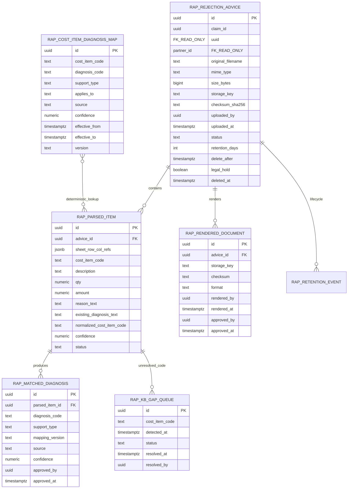

# RAP database ERD

The schema is isolated under the `rap` PostgreSQL schema. Core-domain identifiers are intentionally represented as UUID read-only references in this step because the exact core table contracts have not yet been approved. No core table is changed.

## Governance/audit entities

The following tables are intentionally independent of the business-data graph and are append-only at the database trigger boundary:

- `rap_ai_action_log`
- `rap_ai_approval_token`
- `rap_ai_system_card`
- `rap_model_version_log`
- `rap_human_oversight_log`
- `rap_ai_incident`
- `rap_retention_event`

Ghana governance entities:

- `rap_data_protection_register`
- `rap_consent_record`
- `rap_dsr_request`

Administrator/IT entities:

- `rap_audit_finding`
- `rap_it_report`

## Referential-integrity policy

RAP-owned relationships use restrictive foreign keys. No `CASCADE` behavior is used. References to claims, partners, users, patients/data subjects, diagnosis masters, and notification recipients remain adapter-owned until the corresponding core contracts are explicitly mapped.

This prevents RAP from silently taking ownership of core data lifecycle decisions.
